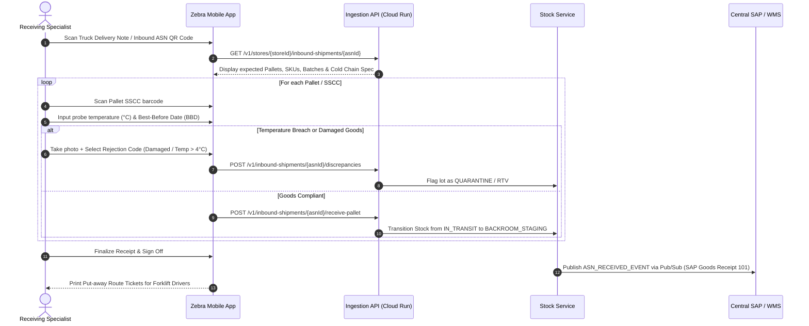
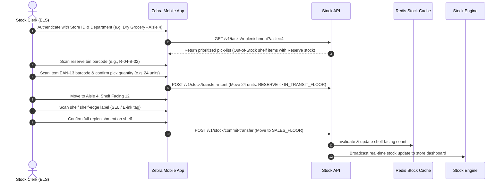

# Product Requirements Document (PRD): Carrefour Stock Flow (Smart Supermarket Stock Management)

> **Document Status**: `FROZEN / BINDING CONTRACT`  
> **Target Entity**: Carrefour Group (Supermarkets & Hypermarkets)  
> **Cloud Baseline**: Google Cloud Platform (GCP) — Well-Architected Framework (WAF) Compliant  
> **Downstream Contract**: Single authoritative source of truth for architectural design, security posture, interface decomposition, and test engineering.

---

## 1. Executive Summary & Business Goals

### 1.1 Problem Statement
In retail grocery operations, inventory inaccuracy directly impacts customer satisfaction, store profitability, and food waste. Carrefour hypermarkets and supermarkets manage between 15,000 and 60,000 active SKUs across ambient, chilled, and frozen departments. Currently, supermarket stock management suffers from:
- **Siloed & Lagging Data**: Batch updates from point-of-sale (POS) and Enterprise Resource Planning (ERP - SAP Retail) create a 2- to 12-hour blind spot between physical shelf reality and system inventory.
- **Unsegmented Stock Access**: Staff across different departments (Fresh Foods, Butchery, Dry Grocery, Reserve/Dock) lack tailored tooling scoped to their operational zones, leading to erroneous stock adjustments, missed stock rotations (FIFO/FEFO), and unauthorized write-offs.
- **Phantom Inventory & Stockouts**: Items recorded as "in stock" are often misplaced in backroom staging or stolen, resulting in On-Shelf Availability (OSA) drops of 4–8% on peak shopping days.
- **Food Waste & Spoilage**: Near-expiration items are not detected proactively, causing avoidable shrinkage (demarque inconnue et connue) and missed opportunities for automated dynamic markdowns (*anti-gaspillage*).

### 1.2 Business Objective & Value Proposition
**Carrefour Stock Flow** is an enterprise, cloud-native, event-driven supermarket stock management solution running on Google Cloud. It empowers store associates and department managers with role-tailored workflows (via rugged mobile handheld terminals/Zebra Android devices and web consoles) to track, receive, audit, replenish, and adjust stock in real time.

The system enforces strict role-based stock domain isolation, provides sub-second event ingestion for POS depletion and dock receipts, automates expiry date management, and synchronizes seamlessly with central SAP ERP systems.

### 1.3 Key Performance Indicators (KPIs) & Target Metrics
| Metric | Baseline (Legacy) | Target (Carrefour Stock Flow) | Measurement Cadence |
|---|---|---|---|
| **On-Shelf Availability (OSA)** | 92.4% | **≥ 98.0%** | Weekly automated audit |
| **Inventory Record Accuracy (IRA)** | 84.0% | **≥ 96.5%** | Continuous cycle counts |
| **Perishable Shrinkage / Waste Rate** | 2.8% of sales | **≤ 1.6% of sales** (-40% waste) | Monthly financial close |
| **Dock-to-Shelf Cycle Time** | 4.5 hours | **≤ 90 minutes** | Daily logistics tracking |
| **Stock Discrepancy Reconciliation Time** | 48 hours (batch) | **< 60 seconds** (near real-time) | Real-time system monitoring |
| **Staff Productivity (Replenishment Scans/hr)** | 85 items/hr | **≥ 140 items/hr** | Bi-weekly operations review |

---

## 2. Target Personas & Role-Based Access Scopes

To guarantee stock accountability, permissions are strictly partitioned by operational function and store department hierarchy (Zone/Department/Aisle).

| Persona | Role & Workstation | Scope of Stock Authority | Primary Goals & Operational Needs | Key Pain Points |
|---|---|---|---|---|
| **Receiving Dock Specialist** (*Réceptionnaire Quai*) | Goods Inward / Loading Dock (Zebra TC58 Handheld + Fixed Terminal) | **Inbound Dock & Staging Zones**. ASN receiving, pallet breakdown, RTV (Return to Vendor), temperature verification. | Fast discrepancy checking against Purchase Orders (POs) and Advanced Shipping Notices (ASNs); immediate quarantine of damaged or temperature-breached lots. | Manual paper manifests, slow manual matching, supplier over-delivery/shortage disputes. |
| **Department / Section Manager** (*Chef de Rayon - e.g. Fresh, Grocery, Liquids*) | Sales Floor & Backroom (Tablet / Zebra + Back-office PC) | **Assigned Department Category Only** (e.g., Dairy & Fresh). Ordering approval, cycle counts, wastage approval, shelf allocations, dynamic markdown pricing. | Autonomous departmental stock control, instant visibility into out-of-stocks, fast approval of shrink/breakage, automated re-ordering recommendations. | Cross-department noise, having to wait for central ERP batch jobs, inflexible inventory counting. |
| **Stock Clerk / Replenisher** (*Employé Libre-Service - ELS*) | Sales Floor Aisles & Reserve Shelving (Zebra TC26 Handheld Scanner) | **Assigned Aisles & Reserve Locations**. Bin-to-shelf transfers, facing audits, barcode scanning, zero-stock reporting, gap scanning. | Instant lookup of reserve backroom stock for empty shelf facings; fast guided replenishment pick paths; one-tap zero-stock triggers. | Searching for misplaced reserve pallets, phantom stock indicating availability when reserve is empty. |
| **Quality & Freshness Agent** (*Contrôleur Fraîcheur / Anti-Gaspi*) | Perishable & Fresh Aisles (Zebra Handheld + Mobile Bluetooth Label Printer) | **Perishables & Short-Life SKUs (DLC/DLUO)** across Fresh, Meat, Fish, Ready-to-Eat. Expiry audit, markdown sticker generation, food bank donation dispatch. | Daily routine scan of expiring lots, instant application of 20%/30%/50% markdown labels, logging items for *Too Good To Go* or charity donation. | Manual sticker application, missing hidden expired items behind fresh stock, untracked waste. |
| **Store General Manager** (*Directeur de Magasin*) | Store-wide & Management Office (Desktop Web Console + Mobile Executive App) | **Entire Store (All Departments & Reserves)**. Global stock valuation, shrinkage heatmaps, store-to-store emergency transfers, high-value write-off sign-off. | Macro-level store health, shrink prevention, compliance with chain merchandising standards, margin protection. | Lack of unified store dashboards, delayed visibility into stock shrinkage trends until bi-annual full inventory. |
| **Central Supply Chain Planner** (*Approvisionneur Central*) | Regional Headquarters (Cloud Web Portal / Headless API) | **Multi-store Regional Inventory & Replenishment Policies**. Min/Max thresholds, safety stock formulas, promotional push allocations. | Accurate store demand forecasting, centralized replenishment orchestration, lead-time optimization. | Outdated store inventory data causing bullwhip effect in regional distribution centers (DCs). |

---

## 3. Detailed User Journeys

### 3.1 Journey 1: Receiving Dock Intake & Cold Chain Validation (Receiving Dock Specialist)

### 3.2 Journey 2: Guided Shelf Replenishment & Gap Trigger (Stock Clerk / ELS)

### 3.3 Journey 3: Perishable Expiry Audit & Anti-Waste Dynamic Markdown (Quality & Freshness Agent)
1. **Initiation**: Every morning at 06:00, the Quality Agent opens the *Date Control & Anti-Gaspi* module on the Zebra scanner.
2. **System Guidance**: The application highlights all batches in Fresh & Dairy due to expire in $T-2$ days or $T-1$ days based on received lot numbers.
3. **Physical Verification**:
   - Agent navigates to Dairy (Rayon Frais) and scans the batch EAN/DataMatrix.
   - For items expiring tomorrow ($T-1$), system suggests a 30% markdown; for items expiring today ($T-0$), system suggests 50% markdown.
4. **Execution**:
   - Agent confirms quantity of units (e.g., 14 yogurts).
   - The handheld triggers the mobile Zebra Bluetooth printer: prints 14 yellow "Anti-Gaspi" promotional barcodes with embedded discounted prices.
   - Agent places stickers on product front.
5. **System Reconciliation**:
   - Stock system writes an event: `ITEM_MARKED_DOWN` ($qty=14$, discount=30%).
   - POS engine is updated via Pub/Sub so that either the original EAN or promotional sticker scans smoothly at checkout.
   - For unsold items at closing ($T+0$, 20:00), agent scans item for `CHARITY_DONATION` or `BIO_WASTE_REMOVAL`, generating fiscal donation slips and decrementing stock cleanly from store inventory.

### 3.4 Journey 4: Department Inventory Cycle Count & Variance Approval (Department Manager)
1. **Scheduled Count**: Manager initiates a weekly rolling count on Category "Coffee & Hot Drinks".
2. **Blind Counting**: Mobile clerks scan items on shelves and reserve; quantities are hidden to prevent confirmation bias.
3. **Variance Calculation**: System compares physical count against theoretical system stock.
4. **Approval Threshold Enforcement**:
   - Variances $<\ €50$ total value: Auto-approved and reconciled immediately.
   - Variances between $€50$ and $€500$: Pushed to Department Manager inbox with high-risk item flags (e.g. high shrinkage on premium coffee beans). Manager enters root cause (Theft / Breakage / Internal Consumption / Miscount) and approves.
   - Variances $>\ €500$: Automatically escalated to Store General Manager for dual-key authorization before stock ledger balance adjustment.

---

## 4. Functional Requirements (FR)

### Module 1: Inbound Logistics & Receiving (Dock)
* **FR-1.1 [ASN Ingestion & Verification]**: The system MUST ingest Advance Shipping Notices (ASNs) from Carrefour Supply Chain ERP (SAP) via EDI/JSON within 5 minutes of truck departure from the distribution center.
* **FR-1.2 [Pallet & Item Scanning]**: The system MUST support standard GS1-128, SSCC-18, and EAN-13 barcode formats, enabling batch, lot, and serial number capture at receipt.
* **FR-1.3 [Cold Chain & Quality Gating]**: The system MUST mandate temperature input for chilled (0°C to 4°C) and frozen (-18°C) product categories before stock can be marked as available.
* **FR-1.4 [Discrepancy & Claims Management]**: The system MUST automatically generate discrepancy reports (overage, shortage, damage) and dispatch electronic carrier claims with attached photo proof.

### Module 2: Multi-Zone Stock Ledger & Location Tracking
* **FR-2.1 [Multi-Zone Topology]**: The system MUST partition store inventory into granular virtual and physical sub-locations: `RECEIVING_DOCK`, `COLD_STORAGE_RESERVE`, `DRY_RESERVE`, `IN_TRANSIT_FLOOR`, `SALES_FLOOR_FACING`, `QUARANTINE_DAMAGED`, `CUSTOMER_CLICK_COLLECT_STAGED`.
* **FR-2.2 [Internal Stock Movement]**: The system MUST support two-step transfer validation (pick from reserve $\rightarrow$ deposit at shelf) to prevent phantom stock during active replenishment.
* **FR-2.3 [Real-time POS Depletion]**: The system MUST subscribe to POS till transaction events and deduct sales floor inventory within $\le 5$ seconds of receipt printing.

### Module 3: Role-Based Access Control (RBAC) & Department Partitioning
* **FR-3.1 [Departmental Scoping]**: The system MUST restrict Department Managers and Section Clerks so they can only view and modify stock balances, create purchase orders, and record waste within their assigned store department IDs (e.g., Grocery, Fresh, Non-Food, Beverages).
* **FR-3.2 [Dual-Sign-off on High-Value Adjustments]**: The system MUST enforce a configurable value threshold (default: $€500$) requiring Store General Manager approval before any negative inventory manual adjustment is permanently committed.
* **FR-3.3 [Store Switching Isolation]**: For roaming staff or regional managers, the system MUST strictly maintain tenant store isolation (`store_id` contextual partition in every API call and database row).

### Module 4: Perishable Date Tracking & Dynamic Markdown (Anti-Gaspi)
* **FR-4.1 [Lot Expiration Auditing]**: The system MUST maintain expiration date records (DLC - *Date Limite de Consommation* / DLUO - *Date Limite d'Utilisation Optimale*) per received batch and generate daily replenishment/markdown alerts.
* **FR-4.2 [Promotional Markdown Labeling]**: The system MUST integrate with ESC/POS mobile Bluetooth label printers to generate GS1 Databar / EAN-13 compliant discount stickers.
* **FR-4.3 [Donation & Spoilage Write-Off]**: The system MUST log charity donations (Banques Alimentaires) and food waste destructions with reason codes conformant with French AGEC law (*Anti-Gaspillage pour une Économie Circulaire*).

### Module 5: Continuous Inventory Counting & Shrink Analytics
* **FR-5.1 [Perpetual Cycle Counts]**: The system MUST generate rolling daily/weekly cycle count assignments targeting high-shrinkage (demarque inconnue), high-velocity (Class A), and negative-stock SKUs.
* **FR-5.2 [Blind Count Verification]**: Handheld counting interfaces MUST NOT display expected stock counts to counting personnel.
* **FR-5.3 [Shrinkage Heatmaps & Anomaly Detection]**: The system MUST provide department managers and store directors with shrinkage analytics showing loss patterns by aisle, time of day, and product category.

---

## 5. Non-Functional Requirements (NFR) — Google Cloud WAF Matrix

The solution architecture strictly aligns with the 7 pillars of the **Google Cloud Well-Architected Framework**:

| WAF Pillar | Requirement & Target Metric | Contractual Target Value | Verification & Enforcement Method |
|---|---|---|---|
| **1. System Design** | Regional High Availability, Multi-Zone Redundancy, Serverless Container Execution | Compute on **Cloud Run** (regional auto-scaling, min instances=2 across 3 zones). Database on **Cloud Spanner** (or **Cloud SQL PostgreSQL Enterprise Edition** with regional HA standby). Event bus on **Cloud Pub/Sub**. | Automated Terraform IaC validation; disaster recovery chaos drill; regional failure failover test. |
| **2. Operational Excellence** | Automated CI/CD, Observability, SLO Monitoring & Error Budgets | **99.95% Availability SLO** for store operational hours (05:00 - 23:00 CET). Structured JSON logging via Google Cloud Logging, distributed tracing via Cloud Trace, OpenTelemetry metrics. Cloud Monitoring dashboards with error budget burn rate alerting. | Cloud Monitoring Alerting Policies; PagerDuty integration; SLO verification via Cloud Trace synthetic probes every 60s. |
| **3. Security, Privacy & Compliance** | Zero Trust, IAM Least Privilege, Data Encryption, RGPD/GDPR & PCI-DSS Scoping | **Cloud Identity & Access Management (IAM)** with short-lived OAuth 2.0 / OIDC tokens. Store associate authentication via corporate Google Workspace / Carrefour Okta IDP federation. All secrets in **Secret Manager**. Data encryption at rest via Customer-Managed Encryption Keys (**CMEK / Cloud KMS**). Perimeter protected by **Cloud Armor** (WAF + rate limiting). Strict store-level row-level security (RLS). | Security Command Center (SCC) Premium continuous scanning; SAST/DAST in Cloud Build pipeline; semi-annual penetration test. |
| **4. Reliability & Disaster Recovery** | High Availability, Idempotency, Store Network Offline Tolerance | **RTO < 15 minutes**, **RPO < 1 minute**. All mutative endpoints (`POST`, `PUT`, `PATCH`) MUST enforce UUID-based idempotency keys (`Idempotency-Key` header). Mobile Zebra clients MUST support **offline-first local caching (Room/SQLite)** to allow scanning in deep basement cold-rooms or network dead zones, syncing with exponential backoff upon reconnection. | Chaos Mesh network partition simulation; automated idempotency replay unit and contract tests. |
| **5. Cost Optimization** | Serverless Rightsizing, Scale-to-Zero, Cold Data Tiering | Store applications scale down to minimum footprint (scale-to-zero or 1 idle instance) during closed store hours (00:00 - 05:00). Cloud Storage lifecycle rules transition historical audit logs and photo evidence from Standard to **Nearline (30 days) $\rightarrow$ Archive (365 days)**. Monthly cloud compute cost $\le €45$ per supermarket store instance. | GCP Cost Allocation Tags (`cost_center:carrefour_stock`, `store_id`); Cloud Billing Budgets with Slack/PubSub alert webhooks at 50%, 80%, 100%. |
| **6. Performance Optimization** | Sub-second Transaction Latency, High-Throughput Barcode Scanning | **P95 Latency < 120ms**, **P99 Latency < 250ms** for barcode lookups and inventory movements. POS transaction ingestion pipeline capable of absorbing **15,000 events/second** across 1,200 supermarket stores during peak Saturday rush. Memorystore for Redis provides sub-10ms cached stock lookups. | Locust / k6 load testing against staging environment simulating peak Christmas/Black Friday supermarket traffic. |
| **7. Sustainability** | Carbon-Free Energy (CFE) Maximization & Green Computing | Workload deployed exclusively in Google Cloud Low-Carbon Regions: **`europe-west9` (Paris, France - CFE ~85-90%)** as primary, and **`europe-west1` (Belgium - CFE ~80%)** as secondary backup. Nighttime heavy analytic batch jobs scheduled when grid carbon intensity is lowest using Google Cloud Carbon Footprint API insights. | GCP Carbon Footprint dashboard; Region constraint enforced via Terraform Organization Policy (`constraints/gcp.resourceLocations`). |

---

## 6. Key Decisions & Architectural Trade-offs (WAF Alignment)

### Decision 1: Compute Architecture — Cloud Run vs. GKE
* **Decision**: Adopt **Cloud Run** for all microservices (Ingestion API, Stock Core, Task Orchestrator, Expiry Engine).
* **WAF Pillar Alignment**: *Operational Excellence, Cost Optimization, Sustainability*.
* **Rationale**: Supermarkets exhibit extreme diurnality (heavy usage from 06:00 to 21:00, near zero between 00:00 and 05:00). Cloud Run provides zero-management auto-scaling down to zero instances per service during nighttime hours, slashing operational overhead and carbon footprint compared to 24/7 idle GKE worker nodes.

### Decision 2: Ingestion & Decoupling — Cloud Pub/Sub + Cloud Tasks
* **Decision**: Event-driven decoupled communication for POS depletions, SAP ERP updates, and mobile scan updates via **Cloud Pub/Sub** with dedicated dead-letter queues (DLQ), and **Cloud Tasks** for rate-limited downstream calls to legacy SAP systems.
* **WAF Pillar Alignment**: *Reliability & Performance Optimization*.
* **Rationale**: POS registers cannot be blocked by downstream inventory database locking. Pub/Sub acts as a shock absorber during store rush hours, ensuring 99.99% ingestion durability even if the stock database undergoes transient maintenance.

### Decision 3: Storage Strategy — Hybrid Cloud SQL Regional HA + Memorystore Redis
* **Decision**: PostgreSQL on **Cloud SQL (Enterprise Plus, Regional HA)** with read replicas for operational reporting, combined with **Memorystore for Redis** as an in-memory look-aside cache for rapid barcode lookups.
* **WAF Pillar Alignment**: *Performance, Reliability & System Design*.
* **Rationale**: Retail stock requires ACID transactional guarantees (preventing race conditions where two clerks replenish or claim the same reserve pallet). Relational PostgreSQL handles ACID transactions with row-level locks, while Redis absorbs 90% of read-heavy barcode queries from hand-scanners.

### Decision 4: Mobile Offline-First Resilience on Store Floor
* **Decision**: Mobile client architecture uses Android Jetpack WorkManager + Room SQLite local database with cryptographic local buffering.
* **WAF Pillar Alignment**: *Reliability & Operational Excellence*.
* **Rationale**: Supermarket reserve basements and metal-shielded refrigerated walk-in freezers often have dead Wi-Fi/4G zones. Associates cannot be stalled while scanning pallets. Scans are committed locally and synchronized automatically with idempotent batch APIs once signal is restored.

---

## 7. Agile User Stories & Acceptance Criteria

### Epic 1: Role-Scoped Inventory Operations
#### Story US-1: Department-Scoped Stock View
* **As a** Section Manager (*Chef de Rayon*),
* **I want to** filter and manage stock only for my designated store department (e.g., Bakery & Pastry),
* **So that** I am not overwhelmed by irrelevant products and cannot accidentally adjust other departments' stock.
* **Acceptance Criteria**:
  - [ ] **AC-1.1**: Given a user authenticated with role `CHEF_DE_RAYON` and department `RAYON_FRAIS`, when querying `/v1/stores/{id}/stock`, then only products mapped to `RAYON_FRAIS` category taxonomy are returned.
  - [ ] **AC-1.2**: Given a user attempting to update stock in `RAYON_EPICERIE` without cross-department delegation rights, when submitting an adjustment, then the system returns HTTP `403 Forbidden` with error code `ERR_OUT_OF_SCOPE_DEPARTMENT`.
  - [ ] **AC-1.3**: Given any stock lookup, response time must satisfy WAF Performance NFR (P99 $< 250$ms).
* **Contractual WAF Alignment**: Addresses Security (Least Privilege RBAC) and Performance.

#### Story US-2: Dual-Key Authorization for High-Value Shrinkage
* **As a** Store General Manager (*Directeur de Magasin*),
* **I want to** review and authorize any inventory write-off exceeding $€500$ before it updates the financial ledger,
* **So that** I prevent internal fraud, unaccounted leakage, and erroneous manual entries.
* **Acceptance Criteria**:
  - [ ] **AC-2.1**: Given a stock adjustment request with total financial value $\ge €500.00$, when submitted by a Section Manager, then the stock state transitions to `PENDING_DIRECTOR_APPROVAL` and sends a notification push to the Director's console.
  - [ ] **AC-2.2**: Given a pending adjustment, when approved by the Director, then the physical stock is deducted, the reason code is locked, and an audit trail log is written to BigQuery.
  - [ ] **AC-2.3**: Given a pending adjustment, when rejected by the Director, then stock remains intact and a mandatory explanation note is returned to the initiator.
* **Contractual WAF Alignment**: Addresses Security (Separation of Duties) and Operational Excellence (Audit Trail).

### Epic 2: Real-time Inbound Receiving & Quality Gating
#### Story US-3: Receiving Dock ASN Barcode Ingestion & Cold-Chain Check
* **As a** Receiving Dock Specialist (*Réceptionnaire Quai*),
* **I want to** scan inbound pallet SSCC labels and record probe temperatures,
* **So that** non-compliant or temperature-abused perishable goods are quarantined immediately before entering store stock.
* **Acceptance Criteria**:
  - [ ] **AC-3.1**: Given an inbound refrigerated pallet with target temperature $0^\circ\text{C} - 4^\circ\text{C}$, when the specialist inputs a probed temperature of $7.5^\circ\text{C}$, then the system automatically triggers a `COLD_CHAIN_VIOLATION` prompt, locks the pallet from available inventory, and marks it `STATUS_QUARANTINE`.
  - [ ] **AC-3.2**: Given an incoming SSCC barcode scanned on mobile terminal, when scanned, then matching ASN line items appear in $\le 150$ms from Redis cache.
  - [ ] **AC-3.3**: Given poor dock Wi-Fi, when scans are recorded offline, then the terminal queues transactions locally and pushes them with UUID idempotency tokens upon reconnection without duplicate stock entries.
* **Contractual WAF Alignment**: Addresses Reliability (Offline Tolerance, Idempotency) and Performance.

### Epic 3: Anti-Waste & Dynamic Expiry Markdown
#### Story US-4: Dynamic Expiry Sticker Generation & POS Feed
* **As a** Quality & Freshness Agent (*Contrôleur Anti-Gaspi*),
* **I want to** scan products nearing expiration date and generate discounted markdown labels,
* **So that** Carrefour reduces food waste and recuperates revenue while complying with food safety regulations.
* **Acceptance Criteria**:
  - [ ] **AC-4.1**: Given a perishable product with expiry date $T-1$, when scanned, then the application calculates the 30% markdown price and sends a print command to the paired Bluetooth mobile printer within 800ms.
  - [ ] **AC-4.2**: Given a generated markdown sticker, when scanned, the event is published to Pub/Sub topic `pos-markdown-updates`, allowing checkout scanners to recognize the discounted item instantly.
  - [ ] **AC-4.3**: Given an item reaching expiry date $T+0$ at store close, when scanned for charity donation, then the item is removed from active stock and recorded in the AGEC-compliant tax donation report.
* **Contractual WAF Alignment**: Addresses Sustainability (Food Waste Reduction) and Performance.

---

## 8. Constraints, Assumptions & Out of Scope

### 8.1 Technical Constraints
1. **Target Runtime & Cloud Ecosystem**: 100% Google Cloud managed services, containerized workloads in Python 3.12+ / Go 1.23+, deployed via Terraform.
2. **Mobile Hardware Target**: Android 13+ running on Zebra Enterprise Mobile Computers (TC26, TC58, TC77) with dedicated SE4710 / SE5500 hardware 1D/2D scan engines.
3. **Regional Hosting**: Primary datacenter MUST reside in GCP `europe-west9` (Paris, France) to ensure French data sovereignty, sub-15ms fiber latency to French stores, and high Carbon-Free Energy (CFE) compliance.

### 8.2 Assumptions
1. Carrefour Group's central Okta/Google Workspace SSO is operational and provides OIDC claims including `store_id`, `department_ids`, and `role_name`.
2. Existing POS terminals (Wincor-Nixdorf / NCR) support real-time HTTPS webhooks or Kafka/Pub/Sub event forwarding on transaction completion.
3. Network connectivity (fiber broadband + 4G backup) is present in each supermarket, though localized Wi-Fi blackouts in cold storage reserves are expected and mitigated via offline-first mobile sync.

### 8.3 Out of Scope (Phase 1)
* **Automated Robot Shelf Scanners**: Autonomous mobile robotic aisle scanners (Simbe / Bossa Nova) will be evaluated in Phase 2.
* **Customer Direct Purchasing on Scanners**: Customer self-scanning (*Scan & Go*) is handled by a separate consumer application; this PRD strictly governs employee stock operations.
* **E-Commerce Warehouse Automated Fulfillment (CFC)**: Central automated dark stores / Ocado CFCs are governed by supply chain warehouse management systems (Manhattan/BlueYonder), not in-store supermarket software.
