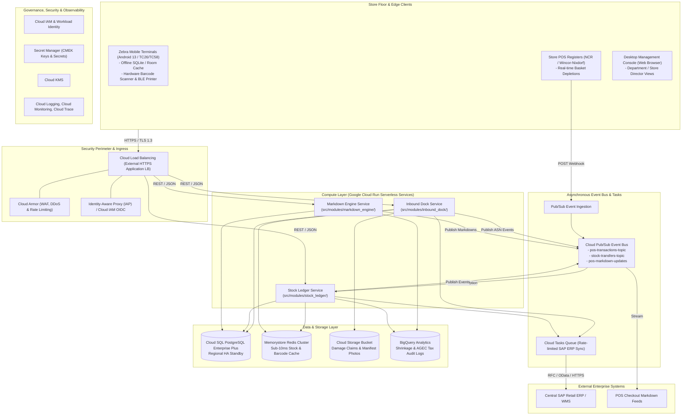

# System Architecture Specification: Carrefour Stock Flow

> **Status**: `FROZEN / MACRO-ARCHITECTURE BASELINE (Gate 0)`  
> **Source**: Lead Cloud Architect (`/architect-design`)  
> **Contractual Input**: [`docs/PRD.md`](file:///home/user/carrefour-stock/docs/PRD.md)  
> **Governance**: All downstream subsystem tech leads (`/lead-decompose`) and developers (`/implement`) must conform to the subsystem boundaries and WAF pillars defined herein.

---

## 1. Executive Summary & Macro-Topology

### 1.1 Architecture Vision
**Carrefour Stock Flow** is an enterprise, cloud-native, event-driven supermarket inventory management system running on Google Cloud. It enables sub-second transaction processing for goods receipt at loading docks, two-step guided shelf replenishment, real-time Point of Sale (POS) inventory depletion, anti-waste dynamic markdown pricing (*anti-gaspillage*), and dual-sign-off shrinkage authorization across 1,200 stores.

The architecture is deployed in Google Cloud region **`europe-west9` (Paris, France)**, ensuring French data sovereignty, low network latency (< 15ms) to store terminals, and maximum Carbon-Free Energy (CFE ~85-90%) utilization. Compute is powered by auto-scaling, serverless **Cloud Run** services fronted by **Cloud Load Balancing** with **Cloud Armor** DDoS/WAF protection. State management utilizes a hybrid transactional/cache tier with **Cloud SQL PostgreSQL (Enterprise Plus Regional HA)** and **Memorystore for Redis**. Asynchronous event streaming and enterprise ERP integration are decoupled via **Cloud Pub/Sub** and rate-limited **Cloud Tasks**.

### 1.2 Component Topology Diagram



---

## 2. Subsystem Macro-Decomposition

The architecture decomposes the system into three autonomous, loosely coupled subsystems to enforce clear boundaries, domain isolation, and modular testability:

| Subsystem Name | Directory Root | Core Responsibilities & Domain | Allowed External Dependencies | Assigned Worker |
|---|---|---|---|---|
| **inbound_dock** | `src/modules/inbound_dock/` | Ingests ASNs from SAP; validates SSCC/GS1 barcodes; performs cold-chain probe temperature validation (0°C-4°C / -18°C); executes quarantine gating; generates discrepancy claims; dispatches goods receipt events. | Cloud SQL, Memorystore Redis, Cloud Storage, Cloud Pub/Sub, Cloud Tasks | `subagent-inbound-dock` |
| **stock_ledger** | `src/modules/stock_ledger/` | Manages multi-zone inventory topology (RECEIVING_DOCK, COLD_STORAGE_RESERVE, DRY_RESERVE, IN_TRANSIT_FLOOR, SALES_FLOOR_FACING, QUARANTINE_DAMAGED); two-step replenishment transfers; POS real-time sales depletion; department-scoped RBAC; dual-key shrinkage sign-off (>= €500); blind cycle counts. | Cloud SQL, Memorystore Redis, Cloud Pub/Sub, BigQuery | `subagent-stock-ledger` |
| **markdown_engine** | `src/modules/markdown_engine/` | Tracks lot expiration dates (DLC/DLUO); calculates automated dynamic markdowns (T-1: 30%, T-0: 50%); sends ESC/POS print commands; publishes POS markdown updates; logs AGEC-compliant charity donations and food waste write-offs. | Cloud SQL, Cloud Pub/Sub, BigQuery | `subagent-markdown-engine` |

---

## 3. Frozen Cloud Service Decisions

This table is the **authoritative, frozen** record of the concrete GCP products this architecture commits to. The mechanical Gate 1 auditor reads service selections from **this table only**. Every row names a concrete GCP product and states the WAF driver that justifies it.

| Architectural Concern | Chosen GCP Service | Rationale (WAF Driver) |
|---|---|---|
| Compute | Cloud Run | Scale-to-zero diurnal serverless compute satisfying <= €45/month store budget — Cost Optimization & System Design |
| Primary Datastore | Cloud SQL | ACID relational consistency, row-level locking, and multi-zone HA — Reliability & System Design |
| In-Memory Caching | Memorystore | Sub-10ms latency for mobile barcode scans meeting P95 < 120ms NFR — Performance Optimization |
| Event Streaming | Pub/Sub | Shock-absorbing asynchronous ingestion decoupling POS spikes (15k ev/s) — Reliability & Performance |
| Asynchronous Queuing | Cloud Tasks | Rate-limited dispatch and exponential backoff preventing downstream SAP ERP overload — Reliability |
| Blob / Evidence Storage | Cloud Storage | Durable object storage with automated Nearline/Archive lifecycle policies — Cost Optimization |
| Perimeter Security | Cloud Armor | Layer 7 WAF, DDoS mitigation, and IP rate limiting for public endpoints — Security |
| Identity & Access | Cloud IAM | Zero Trust least-privilege service identity and OIDC token validation — Security |
| Secret Management | Secret Manager | Centralized secret isolation with Cloud KMS CMEK encryption and zero hardcoded credentials — Security |
| Cryptographic Keys | Cloud KMS | Customer-Managed Encryption Keys for data at rest across databases and buckets — Security |
| Observability & Tracing | Cloud Logging | Structured JSON audit logging, distributed Cloud Trace, and SLO monitoring — Operational Excellence |
| Analytical Data Warehouse | BigQuery | Scalable shrinkage analytics, shrinkage heatmaps, and fiscal AGEC donation reporting — Operational Excellence |

---

## 4. Google Cloud Well-Architected Framework (WAF) Compliance

### 4.1 System Design
The system architecture prioritizes statelessness, serverless scaling, and regional multi-zone resilience.
* **Compute Platform**: Microservices are containerized and deployed to **Google Cloud Run** in `europe-west9` across three availability zones. Services scale out instantly on incoming HTTP traffic and scale to zero during store non-operating hours (00:00–05:00).
* **Storage & Database Selection**: **Google Cloud SQL PostgreSQL** (Enterprise Plus Edition) serves as the system of record with synchronous replication to an automatic multi-zone standby instance, ensuring transactional ACID consistency for all stock balance adjustments. Unstructured photo claims and delivery manifests reside in **Google Cloud Storage**.
* **Integration Patterns**: Microservices communicate asynchronously via **Google Cloud Pub/Sub** topics (`pos-transactions-topic`, `stock-transfers-topic`, `pos-markdown-updates`) with Dead-Letter Queues (DLQ) to ensure loose coupling, and **Google Cloud Tasks** for rate-limited throttling of updates to central SAP ERP systems.
* **Official Documentation Citation**: https://cloud.google.com/architecture/framework/system-design

### 4.2 Operational Excellence
Operational processes ensure high availability, proactive error budget management, and continuous delivery.
* **Observability & Distributed Tracing**: Microservices output structured JSON logs to **Google Cloud Logging** containing `trace_id`, `store_id`, and `user_id`. Distributed request tracing via **Google Cloud Trace** tracks end-to-end latency across load balancers, Cloud Run, and database queries.
* **SLO & Alerting Policies**: System enforces a **99.95% Availability SLO** during store operating hours (05:00 - 23:00 CET). Multi-window multi-burn-rate alerting policies in **Google Cloud Monitoring** notify on-call site reliability engineers via PagerDuty when error budget consumption exceeds critical thresholds. Synthetic uptime checks probe API health every 60 seconds.
* **CI/CD & Infrastructure as Code**: Zero manual cloud modifications. Infrastructure is declared using Terraform with Google Cloud provider modules. Deployment pipelines automated via **Google Cloud Build** and **Google Cloud Deploy** enforce canary rollouts with automated rollback on health check failure.
* **Official Documentation Citation**: https://cloud.google.com/architecture/framework/operational-excellence

### 4.3 Security, Privacy, and Compliance
Security implements Zero Trust principles, strict role segregation, and comprehensive cryptographic protection.
* **Identity & Access Management (IAM)**: Store associate and service-to-service authentication is governed by **Google Cloud IAM** and Workload Identity. User authentication integrates with Carrefour corporate Google Workspace / Okta IDP via OpenID Connect (OIDC). Short-lived (60-minute) JWT tokens contain contextual claims (`store_id`, `department_ids`, `role_name`).
* **Role-Based Access Scoping**: Cloud Run middleware intercepts all mutative endpoints:
  - Department Managers are restricted to their assigned department IDs (`RAYON_FRAIS`, `RAYON_EPICERIE`), returning HTTP 403 (`ERR_OUT_OF_SCOPE_DEPARTMENT`) on out-of-scope actions.
  - Inventory write-offs >= €500 automatically trigger a dual-key authorization flow (`PENDING_DIRECTOR_APPROVAL`), requiring Store Director role sign-off.
* **Perimeter Defense**: Google **Cloud Armor** sits at the external load balancer layer, enforcing OWASP Top 10 web application firewall (WAF) rule sets and rate limiting.
* **Secrets & Cryptography**: Zero plaintext secrets in code or environment variables; all API tokens, database credentials, and certificates are managed in Google **Cloud Secret Manager**. Storage buckets and database volumes are encrypted using Customer-Managed Encryption Keys (**CMEK**) through Google **Cloud KMS**.
* **Official Documentation Citation**: https://cloud.google.com/architecture/framework/security

### 4.4 Reliability and Disaster Recovery
High availability, fault tolerance, and network-partition tolerance ensure business continuity on the store floor.
* **High Availability & Failover Targets**: High availability target achieves **RTO < 15 minutes** and **RPO < 1 minute**. Cloud SQL Enterprise Plus provides automated sub-60-second regional multi-zone failover.
* **Store Floor Offline Resilience**: Mobile handheld Zebra terminals leverage an offline-first architecture utilizing Android Jetpack WorkManager and encrypted local SQLite (Room). Scans in RF-shielded basement cold rooms are committed locally and synchronized automatically with exponential backoff once network coverage is restored.
* **Idempotency & Deduplication**: All mutative API endpoints (`POST`, `PUT`, `PATCH`) mandate a UUID-based `Idempotency-Key` header. Requests are deduplicated using a 24-hour cache window in **Google Cloud Memorystore Redis** backed by persistent database unique constraints, eliminating duplicate receipts or double-depletions during network retries.
* **Dead-Letter Resiliency**: Cloud Pub/Sub subscriptions feature Dead-Letter Queues (DLQ) configured with a maximum delivery attempt count of 5, isolating malformed payloads without halting event ingestion.
* **Official Documentation Citation**: https://cloud.google.com/architecture/framework/reliability

### 4.5 Cost Optimization
Serverless scaling down to zero and automated storage lifecycles keep compute spend within contractual budget limits.
* **Scale-to-Zero Compute**: Cloud Run microservices automatically scale down to zero idle instances during closed store night hours (00:00–05:00 CET), eliminating idle CPU/RAM costs and meeting the contractual target of <= €45/store/month.
* **Automated Data Lifecycle**: Unstructured delivery receipt photos and discrepancy evidence in **Google Cloud Storage** transition automatically via lifecycle policies from Standard to Nearline after 30 days, and to Archive storage after 365 days.
* **Cost Allocation & Governance**: All GCP resources are tagged with `cost_center:carrefour_stock` and `store_id`. Google Cloud Billing budgets enforce automated programmatic alerts at 50%, 80%, and 100% of store monthly budget thresholds.
* **Official Documentation Citation**: https://cloud.google.com/architecture/framework/cost-optimization

### 4.6 Performance Optimization
Sub-second responsiveness and high-throughput ingestion prevent operational bottlenecks during peak shopping surges.
* **Latency Profiles & In-Memory Caching**: System guarantees **P95 < 120ms** and **P99 < 250ms** for barcode and stock queries. **Google Cloud Memorystore for Redis** serves as a look-aside cache for hot barcode EAN-13 lookups and shelf-edge label lookups, resolving 90% of read requests in < 10ms.
* **High-Throughput Ingestion**: POS transaction ingestion via Google **Cloud Pub/Sub** effortlessly absorbs peak supermarket surges (15,000 events/second across 1,200 stores on Saturday afternoons), ensuring till receipt printing is never delayed.
* **Connection Pooling**: Serverless Cloud Run services connect to Cloud SQL using Cloud SQL Auth Proxy with configured connection pooling (SQLAlchemy QueuePool / PgBouncer), preventing connection starvation.
* **Official Documentation Citation**: https://cloud.google.com/architecture/framework/performance

### 4.7 Sustainability
Green computing and high Carbon-Free Energy (CFE) utilization minimize carbon impact.
* **Low-Carbon Region Selection**: Workloads reside strictly in Google Cloud region **`europe-west9` (Paris, France)**, which operates at ~85–90% Carbon-Free Energy (CFE), with disaster recovery backups in **`europe-west1` (Belgium, ~80% CFE)**.
* **Serverless Rightsizing**: Cloud Run serverless concurrency optimization eliminates 24/7 idle server energy waste.
* **Carbon-Aware Analytics**: Heavy analytical queries and shrinkage batch jobs in **Google Cloud BigQuery** are scheduled during nighttime off-peak grid hours using insights from the Google Cloud Carbon Footprint API.
* **Official Documentation Citation**: https://cloud.google.com/architecture/framework/sustainability

---

## 5. Cross-Cutting Infrastructural Blueprint

### 5.1 Networking & Ingress Architecture
* **Virtual Private Cloud (VPC)**: Custom regional VPC with dedicated subnets for Serverless VPC Access connectors, Cloud SQL private IP instances, and Memorystore Redis.
* **Private Google Access**: All communication between Cloud Run, Cloud Storage, Secret Manager, and BigQuery traverses Google private backbone without traversing the public Internet.
* **Cloud NAT**: Secure outbound internet egress for third-party logistics APIs and mobile push notifications.

### 5.2 Enterprise Identity & JWT Scoping Architecture
* Store associates authenticate through corporate Okta/Google Workspace SSO, obtaining an OIDC token exchanged for a signed Carrefour Stock Flow JWT token:
  ```json
  {
    "sub": "user_784920@carrefour.com",
    "store_id": "STORE_FR_75015",
    "roles": ["CHEF_DE_RAYON"],
    "department_ids": ["RAYON_FRAIS", "RAYON_LAITERIE"],
    "exp": 1789472400
  }
  ```
* Middleware in each subsystem validates the JWT signature, enforces `store_id` tenant isolation, and verifies that mutative actions match `department_ids`.

---

## 6. Gate 0 / 1 Verification & Subsystem Hand-Off

* **Mechanical Compliance Gates**:
  - MADR Standards: `python3 scripts/validate_adrs.py docs/adr`
  - WAF 7-Pillar Compliance: `python3 scripts/audit_waf_compliance.py docs/architecture.md`
  - Story-Subsystem Traceability: `python3 scripts/audit_traceability.py`

* **Downstream Subsystem Handoffs**:
  1. **Security Architect (`/secops-audit`)**: Synthesizes `docs/security.md`, verifies STRIDE threat modeling, and inspects IAM least-privilege matrices.
  2. **Subsystem Tech Lead (`/lead-decompose`)**: Materializes OpenAPI 3.x interface contracts (`openapi.yaml`) and `SPEC.md` within `src/modules/inbound_dock/`, `src/modules/stock_ledger/`, and `src/modules/markdown_engine/`.
