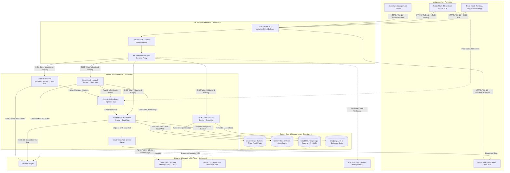

# Security Architecture & Threat Model Specification

## 1. Security Overview & Scope
* **Target System**: Carrefour Stock Flow (Smart Supermarket Stock Management)
* **Authoritative Inputs**: docs/PRD.md
* **Classification**: Confidential / Enterprise Retail Inventory Operations & French Fiscal Compliance
* **Compliance Standards**: Google Cloud Well-Architected Framework (WAF) Security Pillar, OWASP API Security Top 10 (2023), French AGEC Law (*Anti-Gaspillage pour une Économie Circulaire*), RGPD/GDPR
* **Scope Summary**:
  - Store mobile edge devices (Zebra TC26, TC58, TC77 Android handheld terminals with hardware scan engines) and back-office web consoles.
  - Ingress perimeter via Cloud Armor WAF and Cloud Load Balancing.
  - Microservices running on Cloud Run (`inbound-receiving-service`, `stock-ledger-service`, `expiry-markdown-service`, `inventory-count-service`).
  - Asynchronous event bus and ingestion shock absorber via Cloud Pub/Sub (handling 15,000 POS events/sec) and Cloud Tasks for rate-limited SAP ERP integration.
  - Data plane comprising Cloud SQL for PostgreSQL (Enterprise Plus, Regional HA) with Customer-Managed Encryption Keys (CMEK), Memorystore for Redis look-aside cache, and Cloud Storage for cold-chain audit evidence and photo captures.
  - Zero plaintext secrets invariant enforced via Google Cloud Secret Manager and Cloud KMS envelope encryption.

---

## 2. Trust Boundaries & Data Flow Diagram

### Trust Perimeter Classification
1. **Perimeter 1: Store Floor & Network Ingress (Untrusted -> GCP Perimeter)**: Mobile handheld devices operating on Wi-Fi/4G, on-premise POS registers, and external SAP ERP webhooks cross public or store network boundaries into GCP Cloud Armor and Load Balancer. All traffic is mandated over TLS 1.3 with strict identity verification.
2. **Perimeter 2: Ingress Gateway -> Microservice Mesh**: Internal Cloud Run microservices communicate using Google-managed service-to-service IAM OIDC authentication. Direct unauthenticated internet access to microservices is blocked (`ingress: internal-and-cloud-load-balancing`).
3. **Perimeter 3: Workload -> Persistence Data Plane**: Microservices access Cloud SQL via Cloud SQL Auth Proxy with ephemeral SSL certificates over private VPC peering (no public IPs). Cloud Storage and Memorystore Redis reside strictly within private VPC subnets.
4. **Perimeter 4: Security & Cryptographic Plane**: Key management and secret access are strictly delegated to Cloud KMS and Secret Manager. No human or service possesses permanent decryption keys or plaintext static passwords.

---

## 3. STRIDE Threat Analysis Matrix

| ID | Component / Boundary | STRIDE Category | Threat Description | Severity (H/M/L) | Mitigation Control | PRD NFR Traceability | Verification Mechanism |
|:---|:---|:---|:---|:---|:---|:---|:---|
| T-01 | Zebra Handheld & Mobile API Gateway | Spoofing | Rogue device or rogue user presents forged credentials or claims identity of another store associate or department manager. | High | Centralized corporate Google Workspace / Okta OIDC JWT token validation at API Gateway; short-lived tokens (max 60m); cryptographic signature validation using IdP public JWKS. | [NFR-SEC-1], [NFR-SEC-2], FR-3.1 | Automated contract test rejecting unsigned/expired JWTs; OIDC validator unit test suite. |
| T-02 | POS Till Ingestion Webhook | Spoofing | Adversary injects spoofed POS transaction receipts causing phantom stock depletion and storewide inventory corruption. | High | Mutual TLS (mTLS) with store-specific client certificates and HMAC-SHA256 signature verification on POS payload using pre-shared rotating secrets in Secret Manager. | [NFR-SEC-1], FR-2.3 | Integration test verifying signature mismatch returns HTTP 401 Unauthorized; TLS policy check. |
| T-03 | Inbound Cold Chain & Discrepancy Payloads | Tampering | Malicious actor modifies ASN receiving records, temperature probe logs, or pallet SSCC batch data in transit to bypass quarantine. | High | Enforce TLS 1.3 across all hops; tamper-evident cryptographic request hashing; immutable log records written upon pallet intake before approval. | [NFR-SEC-1], [NFR-SEC-4], FR-1.3 | End-to-end integration test asserting cold-chain audit record immutability and TLS 1.3 cipher suite enforcement. |
| T-04 | Database at Rest & Cloud Storage Buckets | Tampering | Direct unauthorized modification or extraction of underlying disks, database tables, or damage claim photo proof. | High | Customer-Managed Encryption Keys (CMEK) via Cloud KMS with AES-256-GCM envelope encryption on Cloud SQL, Redis, and Cloud Storage; Cloud Storage Object Retention Lock enabled. | [NFR-SEC-1], [NFR-SEC-4] | Cloud Asset Inventory compliance check and Cloud KMS key binding audit. |
| T-05 | High-Value Inventory Write-Offs | Repudiation | Store personnel write off > 500 EUR in high-shrinkage merchandise (e.g. alcohol, coffee) and subsequently deny submitting the transaction. | High | Dual-key authorization requirement for write-offs >= 500 EUR; mandatory reason codes; Google Cloud Audit Logs with BigQuery immutable log sink capturing user UID, timestamp, client IP, and before/after state. | [NFR-SEC-1], [NFR-SEC-2], FR-3.2, US-2 | Automated audit sink verification test; unit test asserting write-offs >= 500 EUR trigger PENDING_DIRECTOR_APPROVAL. |
| T-06 | Food Donation & Tax Exemption Slips | Repudiation | Store staff or external entity disputes waste disposal or charity donation slips required under French AGEC law. | Med | Digitally signed fiscal donation receipts with cryptographic hash stored in append-only BigQuery ledger linked to store ID and charity tax ID. | [NFR-SEC-1], FR-4.3 | Automated report generation test verifying cryptographic signature on AGEC donation certificates. |
| T-07 | Error Handling & Stack Trace Leaks | Information Disclosure | Database connection failures, SQL exceptions, or validation bugs return stack traces leaking internal schema, table names, or IPs to mobile users. | Med | Global exception middleware intercepting all unhandled exceptions and emitting RFC 7807 standard problem details JSON; internal stack traces sanitized and logged only to Cloud Logging. | [NFR-SEC-1], [NFR-SEC-2] | Negative unit tests asserting 500 responses return clean RFC 7807 error schema without internal file paths or stack traces. |
| T-08 | Cross-Department & Cross-Store Data Exposure | Information Disclosure | Department Manager from Bakery inspects high-margin Electronics stock, or Associate from Store A accesses stock balances from Store B. | High | Strict row-level security (RLS) and contextual tenant isolation; every API and database query enforces store_id and department_id filters validated against authenticated JWT claims. | [NFR-SEC-1], FR-3.1, FR-3.3, US-1 | RBAC unit and integration test suite asserting HTTP 403 ERR_OUT_OF_SCOPE_DEPARTMENT on cross-boundary requests. |
| T-09 | Public Ingress Volumetric Attack | Denial of Service | External botnet launches volumetric HTTP flood or slowloris attack targeting stock check endpoints during Saturday peak hours. | High | Cloud Armor WAF policy enforcing IP throttling (max 120 req/min per external IP), geo-fencing to European retail territories, and Cloud Run max-instance ceilings. | [NFR-SEC-1], [NFR-SEC-6] | Cloud Armor security policy dry-run configuration audit and simulated flood threshold tests. |
| T-10 | POS Event Buffer Exhaustion | Denial of Service | High Saturday afternoon rush creates 15,000 POS events/sec overwhelming database connection pools and freezing handheld scanners. | High | Cloud Pub/Sub asynchronous event ingestion buffer with dead-letter queue (DLQ) absorbs spikes; Cloud SQL connection pooling via PgBouncer; Memorystore Redis absorbs 90% of read traffic. | [NFR-SEC-6], FR-2.3 | Locust/k6 load test simulating 15,000 events/sec validating P95 latency < 120ms and zero database lock timeouts. |
| T-11 | Container Compromise & Lateral Movement | Elevation of Privilege | Attacker exploits vulnerability in web frontend or PDF generator container to compromise underlying host or pivot to database. | High | Non-root distroless container images, read-only root filesystems, dedicated least-privilege GCP Service Accounts per service, forbidding primitive broad privileges. | [NFR-SEC-1], [NFR-SEC-3] | Cloud Build SAST pipeline check; container image vulnerability scanning via Artifact Registry. |
| T-12 | Unauthorized Privilege Escalation in Mobile App | Elevation of Privilege | Stock Clerk manipulates mobile app local state to invoke General Manager inventory adjustment approval endpoints. | High | Server-side role and claim verification on every mutative endpoint; mobile app UI restrictions mirrored by backend ABAC/RBAC authorization checks requiring DIRECTEUR_MAGASIN role. | [NFR-SEC-1], FR-3.1, FR-3.2, US-2 | Automated API security tests attempting manager mutations using clerk JWT tokens, verifying HTTP 403 Forbidden. |

---

## 4. IAM Least-Privilege Role Matrix

All services execute under strictly dedicated Google Cloud Service Accounts. Broad primitive roles (such as project broad administration or editing) are strictly forbidden across all environments. Workload Identity is enforced for Kubernetes/Cloud Run execution and CI/CD pipelines.

| Subsystem / Service | Dedicated Service Account ID | Assigned Granular GCP IAM Roles | Resource Scope |
|:---|:---|:---|:---|
| **API Ingress Gateway** | `sa-api-gateway@carrefour-stock-prod.iam.gserviceaccount.com` | `roles/run.invoker`, `roles/logging.logWriter`, `roles/monitoring.metricWriter` | `projects/carrefour-stock-prod/locations/europe-west9/services/*` |
| **Inbound Logistics & Dock Service** | `sa-inbound-service@carrefour-stock-prod.iam.gserviceaccount.com` | `roles/cloudsql.client`, `roles/secretmanager.secretAccessor`, `roles/storage.objectCreator`, `roles/pubsub.publisher` | Cloud SQL instance `psql-stock-prod`; Secret `carrefour-stock-db-credentials`; GCS bucket `gs://carrefour-dock-evidence-prod`; Pub/Sub topic `asn-received-events` |
| **Stock Ledger & Location Service** | `sa-stock-ledger@carrefour-stock-prod.iam.gserviceaccount.com` | `roles/cloudsql.client`, `roles/redis.admin`, `roles/secretmanager.secretAccessor`, `roles/pubsub.subscriber`, `roles/cloudtasks.enqueuer` | Cloud SQL instance `psql-stock-prod`; Redis instance `redis-stock-cache-prod`; Secret `carrefour-stock-db-credentials`; Pub/Sub subscription `sub-pos-depletions`; Cloud Tasks queue `queue-sap-sync` |
| **Expiry & Anti-Gaspi Service** | `sa-expiry-markdown@carrefour-stock-prod.iam.gserviceaccount.com` | `roles/cloudsql.client`, `roles/secretmanager.secretAccessor`, `roles/pubsub.publisher`, `roles/pubsub.subscriber` | Cloud SQL instance `psql-stock-prod`; Secret `carrefour-stock-db-credentials`; Secret `carrefour-printer-auth-token`; Pub/Sub topic `pos-markdown-updates` |
| **Cycle Count & Shrinkage Service** | `sa-cycle-count@carrefour-stock-prod.iam.gserviceaccount.com` | `roles/cloudsql.client`, `roles/bigquery.dataEditor`, `roles/secretmanager.secretAccessor` | Cloud SQL instance `psql-stock-prod`; BigQuery dataset `carrefour_stock_audit.shrinkage_events`; Secret `carrefour-stock-db-credentials` |
| **Continuous Delivery Pipeline** | `sa-cicd-deployer@carrefour-stock-prod.iam.gserviceaccount.com` | `roles/run.developer`, `roles/iam.serviceAccountUser`, `roles/artifactregistry.writer` | Cloud Run services in `europe-west9`; Service Accounts `sa-*`; Artifact Registry repo `carrefour-stock-docker` |

---

## 5. Secret Inventory & Cryptographic Controls

All secrets and cryptographic keys are managed through Google Cloud Secret Manager and Cloud Key Management Service (KMS). Secrets are retrieved at container startup or dynamically resolved over IAM-authorized RPC; no secrets are ever persisted in Docker images, configuration files, or plaintext environment variables.

| Secret Name | Storage Mechanism | Consumer Service Account | Encryption Standard | Rotation Schedule |
|:---|:---|:---|:---|:---|
| `carrefour-stock-db-credentials` | Google Cloud Secret Manager | `sa-inbound-service`, `sa-stock-ledger`, `sa-expiry-markdown`, `sa-cycle-count` | Cloud KMS CMEK (AES-256-GCM) | 90 Days (Automated Cloud Function Rotation) |
| `carrefour-pos-webhook-hmac-key` | Google Cloud Secret Manager | `sa-api-gateway`, `sa-stock-ledger` | Cloud KMS CMEK (AES-256-GCM) | 60 Days (Dual-version grace overlap) |
| `carrefour-okta-jwt-public-certs` | Google Cloud Secret Manager | `sa-api-gateway` | Cloud KMS CMEK (AES-256-GCM) | 30 Days (Synchronized with Okta JWKS) |
| `carrefour-sap-erp-mtls-cert` | Google Cloud Secret Manager | `sa-inbound-service`, `sa-stock-ledger` | Cloud KMS CMEK (AES-256-GCM) | 180 Days (Corporate PKI issuance) |
| `carrefour-printer-auth-token` | Google Cloud Secret Manager | `sa-expiry-markdown` | Google Default / KMS CMEK | 90 Days |
| `carrefour-cloudsql-cmek-kek` | Google Cloud KMS KeyRing | Cloud SQL System Service Identity | AES-256-GCM Symmetric Key | 365 Days (Automatic KMS rotation) |
| `carrefour-gcs-evidence-cmek-kek` | Google Cloud KMS KeyRing | Cloud Storage Service Identity | AES-256-GCM Symmetric Key | 365 Days (Automatic KMS rotation) |

### Cryptographic Invariants
1. **Envelope Encryption Pattern**: All sensitive persistent datastores (Cloud SQL database volumes, Memorystore persistence backups, Cloud Storage audit buckets) leverage envelope encryption. Local Data Encryption Keys (DEKs) are dynamically encrypted by Root Key Encryption Keys (KEKs) hosted in Cloud KMS located in `europe-west9`.
2. **Automated Rotation & Grace Periods**: Secret Manager secret rotation triggers Pub/Sub rotation notifications. Mutative webhook HMAC secrets support current and previous versions simultaneously during a 24-hour transition window to eliminate downtime.
3. **Hardware-Backed Device Credentials**: Zebra mobile terminals utilize Android Keystore hardware-backed secure elements to protect client-side offline SQLite encryption keys and cached OIDC refresh tokens.

---

## 6. OWASP API Top 10 Mitigation Summary

The system adheres strictly to the **OWASP API Security Top 10 (2023)** standards across all REST and event interfaces:

* **API1:2023 Broken Object Level Authorization (BOLA)**:
  - Every API endpoint manipulating store stock, inbound pallets, or markdown labels strictly validates tenant ownership (`store_id`) and department scope (`department_id`).
  - Database queries enforce mandatory parameterized predicates: `WHERE store_id = :authenticated_store_id AND department_id = :user_dept_id`. Users cannot view or mutate entities belonging to other departments or stores by tampering with URL parameters.
* **API2:2023 Broken Authentication**:
  - Centralized OIDC JWT token validation executed at the API Gateway.
  - Mobile authentication tokens have a lifetime of 60 minutes; refresh tokens are stored securely in Android Keystore.
  - Inbound POS webhooks enforce mTLS and HMAC-SHA256 signatures with timestamp anti-replay validation (max 60-second drift).
* **API3:2023 Broken Object Property Level Authorization**:
  - Strict Pydantic / dataclass request validation schemas configured with `extra = "forbid"`.
  - Disallows mass assignment vulnerabilities; fields such as `is_approved`, `reconciliation_status`, and `unit_cost` are immutable through standard clerk endpoints and can only be modified through dedicated administrative sign-off APIs.
* **API4:2023 Unrestricted Resource Consumption**:
  - Cloud Armor WAF rate-limiting policies enforce a ceiling of 120 requests/minute per IP address for external consumers.
  - Cloud Run services configure strict maximum instance limits, request timeouts (5s for OLTP, 30s for reporting), and connection pooling limits on Cloud SQL.
  - Redis cache handles barcode lookups to prevent downstream database saturation.
* **API5:2023 Broken Function Level Authorization**:
  - High-privilege administrative functions (such as shrinkage approvals > 500 EUR, store master configuration, and emergency store-to-store stock transfers) verify the user has the explicit `DIRECTEUR_MAGASIN` role claim before executing business logic.
  - Non-privileged requests receive HTTP `403 Forbidden` with standardized RFC 7807 problem payloads.
* **API6:2023 Unrestricted Access to Sensitive Business Flows**:
  - Critical stock operations (such as cycle count variance approvals and bulk inventory write-offs) are protected against automation and rapid replay.
  - Endpoints enforce unique UUID idempotency keys (`Idempotency-Key` header) stored in Redis with a 24-hour TTL to prevent accidental or malicious double-deduction of stock.
* **API7:2023 Server Side Request Forgery (SSRF)**:
  - Microservices operate inside dedicated VPC subnets without public internet egress except through Cloud NAT.
  - SAP ERP and distribution center webhook URLs are hardcoded in environment configuration; user-supplied URLs or redirects are strictly prohibited.
  - Private IP ranges (RFC 1918) and cloud metadata services (`169.254.169.254`) are unreachable from user input.
* **API8:2023 Security Misconfiguration**:
  - Microservices run in minimal distroless non-root container images with read-only root filesystems.
  - HTTP security response headers (`Content-Security-Policy`, `X-Content-Type-Options: nosniff`, `X-Frame-Options: DENY`, `Strict-Transport-Security`) are enforced at the Ingress Gateway.
  - Cross-Origin Resource Sharing (CORS) is restricted exclusively to authorized Carrefour internal console origins.
* **API9:2023 Improper Inventory Management**:
  - All public and internal API versions are governed by versioned OpenAPI 3.x specifications (`src/modules/*/openapi.yaml`).
  - Deprecated API versions are retired according to strict enterprise lifecycle schedules with automated alerting for obsolete client calls.
* **API10:2023 Unsafe Consumption of APIs**:
  - Outbound communications to SAP ERP and partner carrier APIs use validated client interfaces with strict response timeouts (3s), TLS verification, and circuit-breaker patterns to prevent cascading failures.
